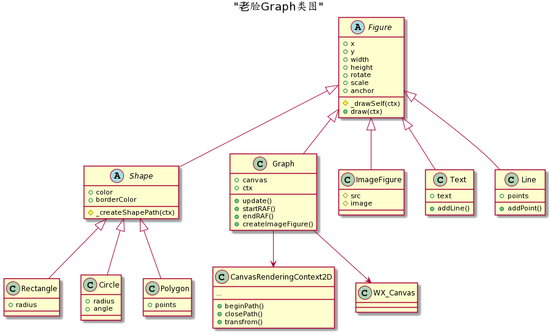

# 开场白
> music 菊次郎的夏天

**Graph工具包是什么？Js Canvas绘制究竟是什么梗？相信大家对Js Canvas绘制都很熟悉，Js Canvas绘制我们每天都会经常遇到的，但是你知道Graph工具包到底是什么吗？来随我一起看看吧。**


# 简介

这会是一片系列文章，我会边做边写。有兴趣的朋友可以一起探讨。
> 项目地址：https://git.weixin.qq.com/eclipseglory/graph

Graph工具包(或者叫lib)将常用的CanvasRenderingContext2D绘制方法封装成类，便于使用。

以绘制一个基于中心位置旋转了45度的圆角矩形为例，直接使用Context 2D代码如下：

```javascript
    ....
    // 矩形大小和位置以及圆角半径：
    let x = 100,y = 100,w = 100,h = 50, r = 10;
    let selector = wx.createSelectorQuery();
    selector.select('#canvas-id').fields({node:true,size:true})
        .exec(function(result){
            if(result[0]){
                let canvas = result[0].node;
                let ctx = canvas.getContext('2d');

                // 根据像素比初始化画布内存以及Context缩放：
                let dpr = wx.getSystemInfoSync().pixelRatio;
                canvas.width = result[0].width*dpr;
                canvas.height = result[0].height*dpr;
                ctx.scale(dpr,dpr);

                // 基于矩形中心旋转45度
                ctx.translate(50,50);
                ctx.rotate(45*Math.PI/180);
                ctx.translate(-50,-50);

                // 绘制圆角矩形
                ctx.beginPath();
                ctx.moveTo(x + r, y);
                ctx.lineTo(x + w - r, y);
                ctx.arc(x + w - r, y + r, r, -Math.PI/2, 0);
                ctx.lineTo(x + w, y + h - r);
                ctx.arc(x + w - r, y + h - r, r, 0, Math.PI/2);
                ctx.lineTo(x+r, y+h);
                ctx.arc(x + r, y + h - r, r, Math.PI/2, Math.PI);
                ctx.lineTo(x, y + r);
                ctx.arc(x + r, y + r, r, Math.PI, Math.PI *1.5);
                ctx.closePath();

                ctx.fillStyle= "some color";
                ctx.fill();
            }
        });
    ....
```
从上面代码可以得知，要利用Context2d绘制，除了要熟悉API外，还要知道如何进行transform的变换，代码繁琐。在一些情况下，为了加快绘制速度，还会用到临时Canvas的辅助以及一些线性代数的计算，甚至是卷积内核计算，这无疑给专注业务的开发人员增加了工作量。

Graph的目的在于，将图形、文字、图片等封装成一个一个的类，通过设置类的属性即可得到对应的图形以及图形变换，减少了代码编写，也不必知道过多的计算细节。

还以绘制圆角矩形为例，使用Graph的代码如下：

```javascript
    const graphLib = require('../some path/graph.min.js');
    ....
    // 矩形大小和位置以及圆角半径：
    let x = 100,y = 100,w = 100,h = 50, r = 10;
    let selector = wx.createSelectorQuery();
    selector.select('#canvas-id').fields({node:true,size:true})
        .exec(function(result){
            if(result[0]){
                let canvas = result[0].node;
                // 新建一个Graph类：
                let graph = new graphLib.Graph(canvas,{
                    canvasWidth:result[0].width,
                    canvasHeight:result[0].height
                });
                // 新建一个Rectangle
                let rrect = new graphLib.shape.Rectangle({
                    x : 100, y : 100 , width:100 , height:100,
                    radius:10, rotate:45,
                    color:'some color'
                });

                // 将图形添加到Graph中：
                graph.addChild(rrect);

                // 刷新Graph得到绘制结果：
                graph.update();
            }
        });
    ....
```

# Graph基本概念
## 概念

如果要绘制一个图形，我们可以将绘制的图形看作一个类，姑且称它为```Figure```，那这个类至少应该拥有以下这些属性：
- **X** ：
左上角x坐标
- **Y** ：
左上角y坐标
- **Width** ：
图形绘制区域的宽度
- **Height** ：
图形绘制区域的高度

并且这个类还应该提供一个可供调用的绘制方法，比如这个方法叫做```draw```
- **Draw()** ： 调用后即可绘制出这个类定义的图形。

如果有这么一个类，那当我们想要绘制它的时候 *伪代码* 会这么写：
```javascript
    var figure = new Figure(); // 创建一个图形对象
    // 这个图形所在位置的左上角坐标为 (50,50)
    figure.x = 50, figure.y = 50; 
    // 这个图形的大小为100x100
    figure.width = 100,figure.height = 100;
    // 调用方法绘制它：
    figure.draw();
```

此外，我们还可以增加一些属性让图形绘制能做些“姿势”的变换，比如旋转、拉伸等：
```javascript
    
    // 让这个图形旋转45度，并且x轴上拉伸为原来的两倍
    figure.rotate = 45;
    figure.scaleX = 2;
    // 调用方法绘制它：
    figure.draw();
```
我们并不关心具体是怎么画出来的，甚至不关心它画的是个什么图形，至少按照类的原则来设计，这就基本足够了。

在这些基本要素都具备的情况下，```Figure```还应该是自包含的类（Composite模式）。

一个```Figure```图形中，可能会有一些其他的图形对象，以此完成一个较为复杂的组合图形，那```Figure```就需要维护自身的“子Figure”。这些“子Figure”虽然有自己的坐标位置，但都是基于它们的“父节点”的，如果父节点发生了变化，比如旋转、拉伸、移动甚至移除等，这些子Figure也会随着一起发生变化。此时的父节点就可以看成是一个“容器”，假设我们想要在一个矩形的中心绘制一个圆形，伪代码如下：
```javascript
    var rect = new Rectangle();// Rectangle是一个绘制矩形的类
    var circle = new Circle();//绘制圆形的类

    // 将圆形加入到矩形中，成为矩形的子图形：
    rect.addChild(circle);
    .... // 设置好各自大小和位置
    // 开始绘制一个矩形，它内部会绘制一个圆形：
    rect.draw();
```
## Graph的设计
上述内容就是Graph工具包最基本的概念：一切皆为对象。

Graph工具包中最基础的类，就叫```Figure```，它定义了一个图形可能拥有的一些属性，比如坐标、大小、子Figure的List等，并且还进行一些绘制规则的设定以及基本的计算（转换矩阵的计算，顶点变换后的世界坐标计算等），但```Figure```并不具体负责绘制，可以视为一个抽象类(但JS里没有这个概念)，所有具体的绘制都需要子类继承它后复写方法规定。比如一个矩形，图片，文字等，都是Graph中的一个类：



## 关于Graph类
Graph工具包中有一个类叫做```Graph```，这个类是一个最顶层的```Figure```，它并不具备自身绘制功能（如果不把清空整个画布看成绘制的话）。

构造```Graph```对象必须带入一个```Canvas```对象节点，好让```Graph```能控制绘制，而其他所要绘制的图形都需要作为```Graph```的子节点，这样一来，只需要调用```Graph```的```update```方法就可以刷新整个```Canvas```，换句话说，```Graph```就是对应画布的一个类。

# 示例
这里有个简单的绘制矩形的例子：https://git.weixin.qq.com/eclipseglory/graph/tree/master/examples/rectangle

小程序代码片段：
https://developers.weixin.qq.com/s/DLKwRlmI7ihs

主要是展示了如何使用Graph工具包，实际上还有一些其他例子，我会在以后的文章中提到。
# 结束语 
**大家可能会感到很诧异，Graph工具包就这个？但事实就是这样，作者我也感到非常诧异。那么以上就是今天老脸为大家整理的关于Graph工具包的内容。关于Graph工具包大家还有什么想说的吗？欢迎在评论区留言或者私信我哦~**

```
@startuml
Title "老脸Graph类图"


Figure<|-- Shape
Figure<|-- Graph
Figure<|-- ImageFigure
Figure<|-- Text
Figure<|-- Line
Shape <|-- Rectangle
Shape <|-- Circle
Shape <|-- Polygon

Graph --> CanvasRenderingContext2D
Graph --> WX_Canvas

abstract Figure{
+ x
+ y
+ width
+ height
+ rotate
+ scale
+ anchor
# _drawSelf(ctx)
+ draw(ctx)
}

class Graph{
+ canvas
+ ctx
+ update()
+ startRAF()
+ endRAF()
+ createImageFigure()
}

class ImageFigure{
# src
# image
}

class Text{
+ text
+ addLine()
}

class Line{
+ points
+ addPoint()
}

abstract Shape{
+ color
+ borderColor
# _createShapePath(ctx)
}

class Rectangle{
+ radius
}
class Circle{
+ radius
+ angle
}
class Polygon{
+ points
}

class CanvasRenderingContext2D{
+ beginPath()
+ closePath()
+ transfrom()
...
}
@enduml
```